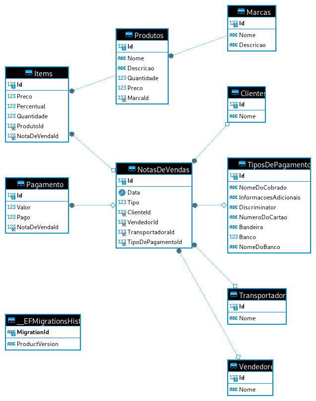
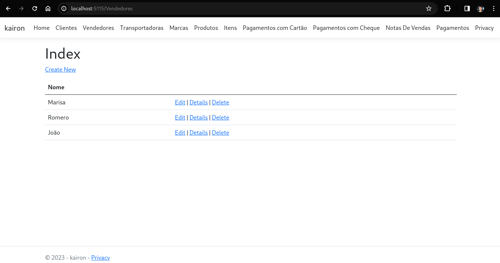
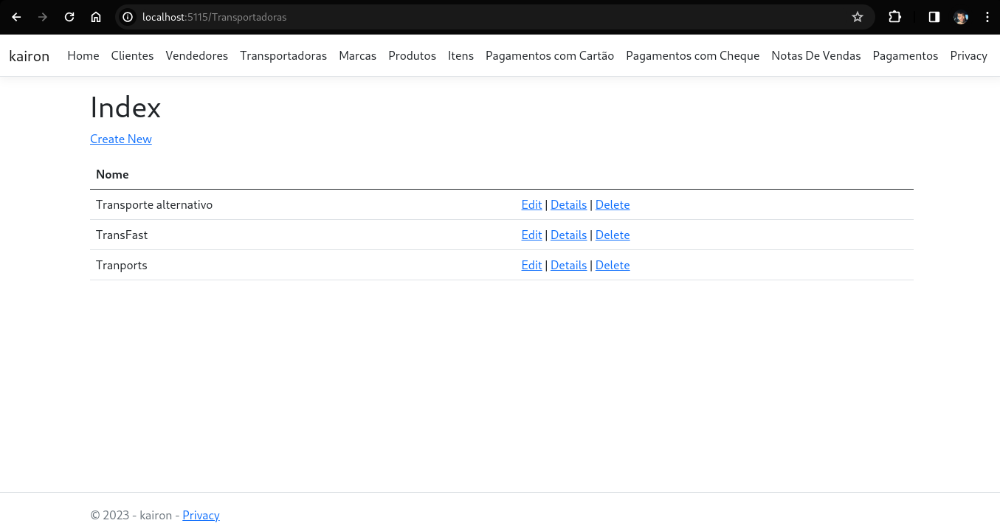
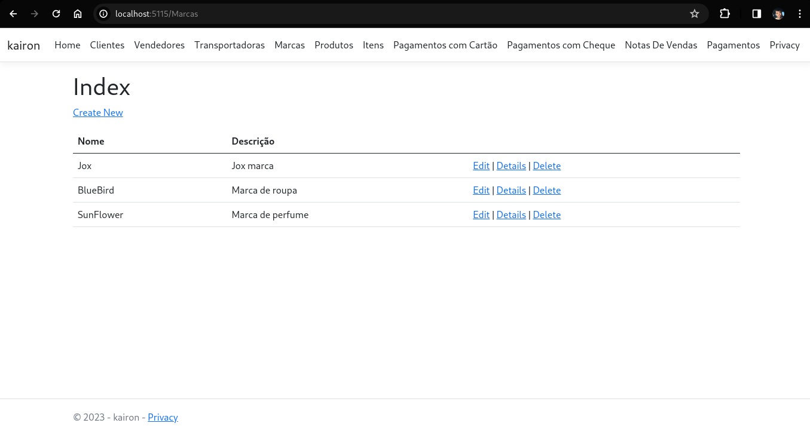
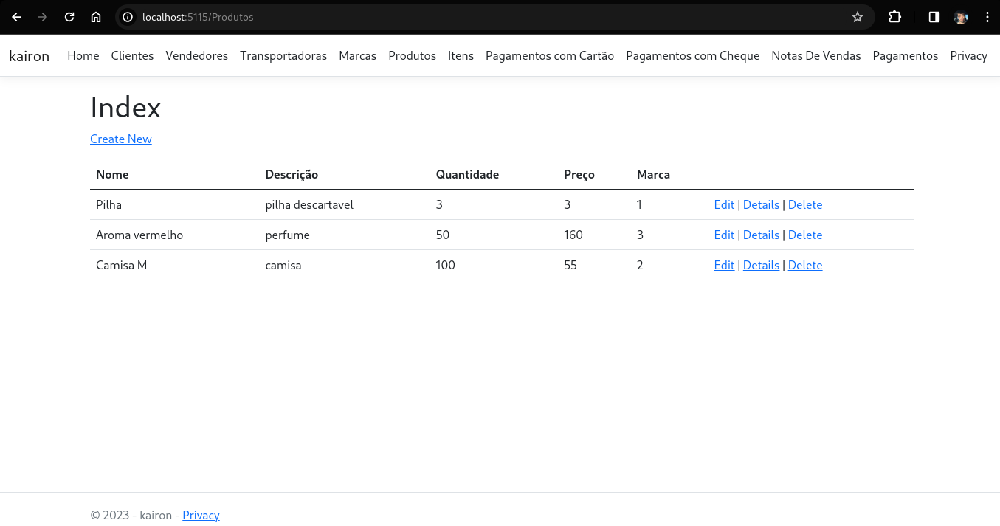
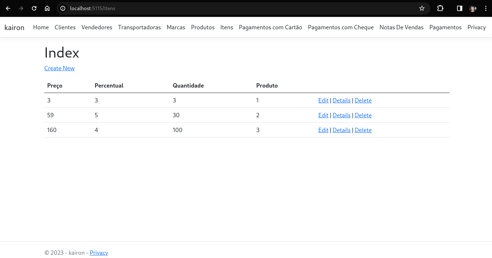
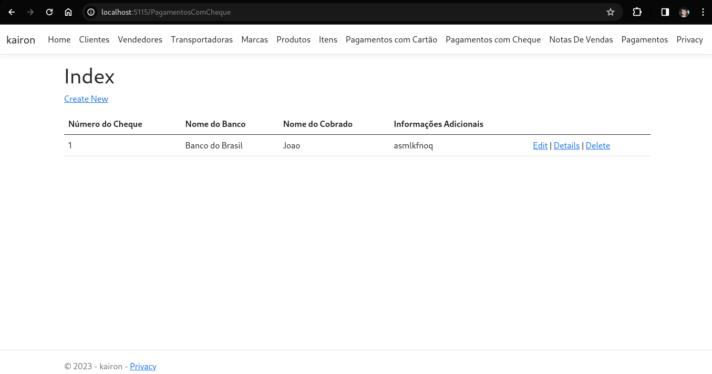
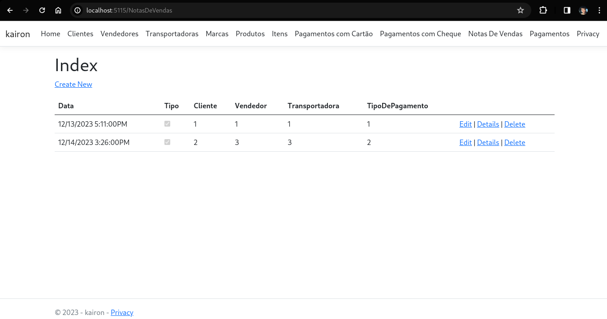
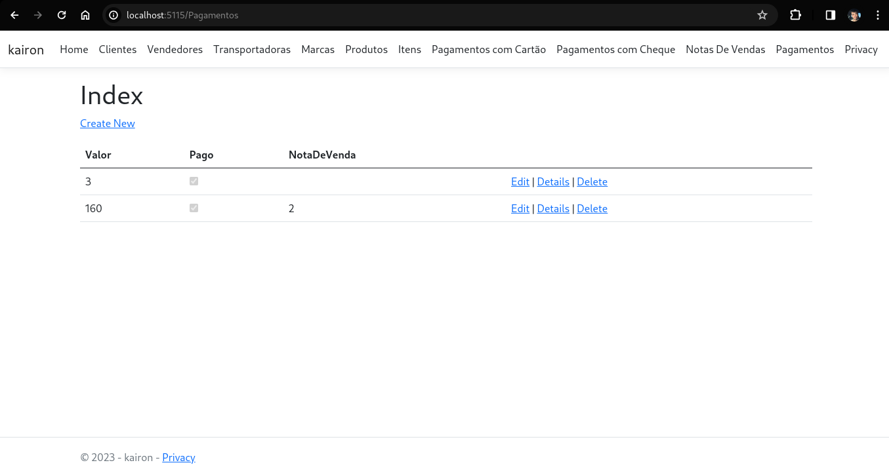

# Trabalho de Análise e Projeto de Sistemas

**Aluno:** Kairon Willyan Ribeiro de Melo  
**Matrícula:** 2022111TADS0258

---

## Descrição do Projeto

Sistema de pagamento utilizando C#

## Tecnologias Utilizadas

- Linguagem de Programação: [C#]
- Framework: [Entity FrameWork]
- Banco de Dados: [MySql]
- Arquitetura: [MVC]

##Diagrama do Projeto



## Instalação e Configuração

1. **Clone o Repositório:**
   ```bash
   git clone git@github.com:KaironWillyan/SistemaDeVendas.git
   ```

2. **Instale as Dependências:**
   ```bash
   cd kairon
   
   dotnet restore

   dotnet build
   ```

3. **Configurações Adicionais:**
   - Coloque sua senha do banco de dados no arquivo [appsettings.json](./kairon/appsettings.json)

4. **Crie o banco e faça as migrate:**

    ```bash
        dotnet ef migrations nome_da_migrate

        dotnet ef database update
    ```

## Como Executar

Após cada mudança significativa que for feita, use:
   ```bash
   
   dotnet restore

   dotnet build
   ```

para executar o projeto, basta apenas o comando:

```bash
dotnet run
```

Acesse o aplicativo em [http://localhost:5115](http://localhost:5115) ou na porta que aparecer em seu terminal.

##Funcionamento

####Telas:

    - Cliente:


    - Vendedores



    - Transportadoras



    - Marcas



    - Produtos



    - Itens



    - Pagamentos com Cartão


    - Pagamentos em Cheque



    - Notas de Venda



    - Pagamentos


